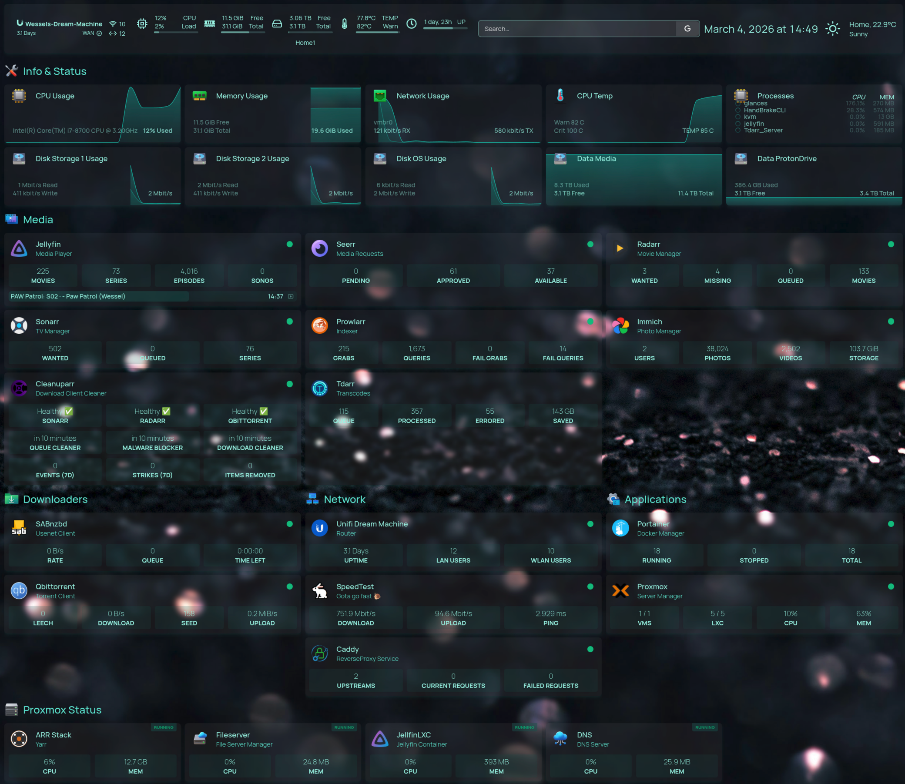

# 🏡 Homelab Configuration

This repository houses the configuration files and `docker compose` stacks for my self-hosted services and homelab infrastructure.

---

> [!NOTE]
> This is the setup for my media server, and you will need to adjust for your own environment, don't just blindly copy and paste.

> [!IMPORTANT]
> ProtonVPN and Caddy is used for external access, adjust your set up as needed.

---

## 💡 Concept
The primary motivations behind this structured configuration repository are:

1.  **Portability:** The use of `docker compose` ensures that the entire stack can be moved to a new machine or cloud provider with minimal changes, promoting resilience and easy hardware upgrades.
2.  **Configuration Management:** By keeping environment variables, network settings, and persistent volumes defined in declarative files, the system state is always known and version-controlled.
3.  **Reproducibility:** Every service can be deployed consistently, allowing quick restoration after a failure (the "infrastructure as code" principle).
4.  **Open Sharing:** To share the setup with the community, allowing others to learn from, adapt, and improve the configuration patterns used for a reliable homelab environment.

---

## 🗃️ Containers

> This the containers that I currently use. 

### 🎥 Media Managment

* **Radarr**: Movie Manager.
* **Sonarr**: TV Show Manager.
* **Prowlarr**: Indexer Manager.
* **Jellseerr**: Media Requests for Sonarr / Radarr.
* **Recyclarr**: Custom Format Manager.

---

### 📥 Downloaders

* **QBittorrent**: Torrent Client.
* **SABnzbd**: Usenet Client.

---

### 🔍 Download Optimizers

* **Cleanuparr**: Stalled Downloads and Queue Cleaner.
* **Huntarr**: Missing Media Item Hunter.

---

### 💻 Misc

* **homepage**: Server Status and Dashboard.
* **SpeedTest-Tracker**: Network Speed Tests.
* **Immich**: Photo Server.
* **Trillium**: Note Repository.

---

